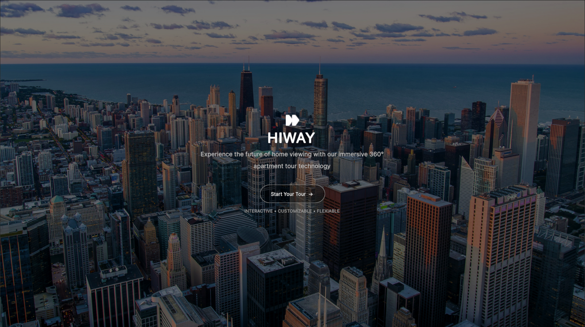
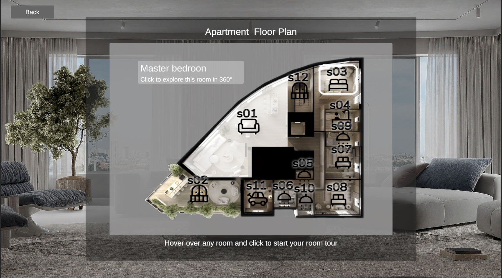
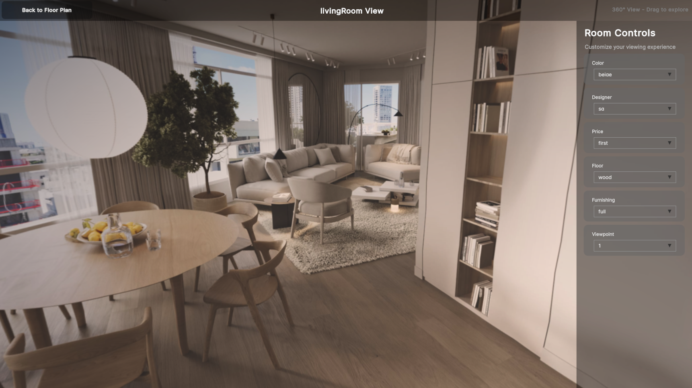

# Unity 360 Room Viewer

This Unity project allows users to navigate a virtual apartment layout, explore different rooms, and view 360° panoramic images from various viewpoints with configurable attributes such as color, designer, floor, and more.
| Page | Responsibilities |  
| ------ | ------ |  
| Main menu | Entry screen with "Start Tour" call-to-action |  
| Main floor plan layout | Interactive layout with clickable room buttons |  
| Room view | 360° panoramic room display with dynamic filter controls |

## Preview







## Technologies Used

- Unity 6 (6000.0.47f1)
- Unity UI tool kit
- Unity UGUI
- AssetsBundle

## Architecture & Patterns

| Singleton Class   | Purpose                                                                     |
| ----------------- | --------------------------------------------------------------------------- |
| Room360Controller | Central controller for room loading, dropdown filters, and panorama display |
| RoomsController   | Manages all room data loaded from disk                                      |

#### AssetBundle & Cache Solution

To optimize performance and memory usage by loading only relevant images and caching them per selected room.

- Each room has its own folder/AssetBundle, named after its ID.
- At runtime, bundles are loaded from `StreamingAssets/` using:
  ```csharp
  UnityWebRequestAssetBundle.GetAssetBundle("file://" + path)
  ```
- Used async/await (Task) for image preloading

## How to run

- Clone or download the project and and open it via Unity Hub - once run it will automatically install all relevant dependancies

### Note

To keep the repository size manageable, the preview images are included in lower resolution.
